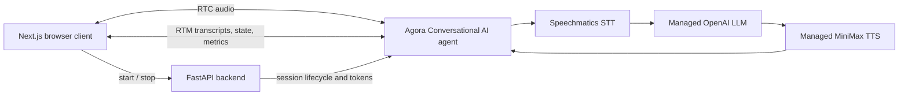

<div align="center">


# Conversational AI Voice Agent - Agora + Speechmatics

**Build a browser-based voice agent with Agora Conversational AI and Speechmatics real-time transcription.**

</div>

This guide uses Agora's maintained Python quickstart rather than duplicating its
FastAPI backend and Next.js client in the Academy. The demo replaces the
quickstart's default speech-to-text provider with Speechmatics while retaining
the managed OpenAI LLM and MiniMax TTS.

## What You'll Learn

- How Speechmatics fits into an Agora Conversational AI pipeline
- How the Python backend starts and stops managed Agora agent sessions
- How RTC carries audio while RTM delivers transcripts, state, and metrics
- How to keep Agora and Speechmatics credentials on the server

## Prerequisites

- **Speechmatics API Key**: Get one from [portal.speechmatics.com](https://portal.speechmatics.com/)
- **Agora project**: RTC, RTM, and Conversational AI must be enabled
- **Python 3.10+**
- **Bun**
- **Agora CLI**, authenticated with `agora login`

## Quick Start

The complete implementation lives in the official
[`agent-quickstart-python`](https://github.com/AgoraIO-Conversational-AI/agent-quickstart-python)
repository. Clone it so fixes to the Agora client, token flow, and agent
lifecycle continue to come from one maintained source.

**Step 1: Clone the demo**

```bash
git clone https://github.com/AgoraIO-Conversational-AI/agent-quickstart-python.git speechmatics-agora-python
cd speechmatics-agora-python
```

**Step 2: Select and configure your Agora project**

```bash
agora login
agora project use <project-id-or-name>
bun run setup
agora project env write server/.env --template standard
bun run setup:env
```

**Step 3: Add the Speechmatics key**

Add your key to `server/.env`:

```dotenv
SPEECHMATICS_API_KEY=your_real_speechmatics_api_key
```

> [!IMPORTANT]
> Keep `AGORA_APP_CERTIFICATE` and `SPEECHMATICS_API_KEY` server-side. Do not
> expose them through browser-prefixed environment variables or commit
> `server/.env`.

**Step 4: Validate and run the demo**

```bash
bun run doctor:local
agora project doctor --deep
bun run dev
```

Open [http://localhost:3000](http://localhost:3000) and select **Start
conversation**.

## How It Works



1. The browser requests a channel configuration from FastAPI.
2. FastAPI creates a scoped RTC and RTM token and starts an Agora agent in the
   same channel.
3. Agora sends the user's audio to Speechmatics for real-time transcription.
4. The managed LLM produces a response and the managed TTS provider returns
   audio to the channel.
5. The browser renders transcripts, agent state, and latency metrics received
   over RTM.

### Speechmatics Provider Configuration

The provider swap is isolated to the agent configuration:

```python
from agora_agent.agentkit.vendors import SpeechmaticsSTT

stt = SpeechmaticsSTT(
    key=self.speechmatics_api_key,
    language="en",
    uri="wss://eu2.rt.speechmatics.com/v2",
)
```

The demo pins `agora-agents==2.6.1` and passes the credential through `key`.
Its regression tests verify that the SDK serializes this as `params.key`, not
the deprecated `api_key` field.

## Expected Output

After **Start conversation** is selected:

```text
Browser joins the Agora RTC channel
Agora agent starts in the same channel
Speechmatics transcribes microphone audio
Live transcript, state, and metrics appear in the browser
The agent replies with synthesized audio
```

The local services are:

| Service | URL |
| --- | --- |
| Next.js client | `http://localhost:3000` |
| FastAPI backend | `http://localhost:8000` |
| FastAPI API docs | `http://localhost:8000/docs` |

## Configuration Options

| Variable | Required | Purpose |
| --- | --- | --- |
| `AGORA_APP_ID` | Yes | Agora project identifier |
| `AGORA_APP_CERTIFICATE` | Yes | Server-side Agora token credential |
| `SPEECHMATICS_API_KEY` | Yes | Server-side Speechmatics STT credential |
| `AGENT_GREETING` | No | Overrides the agent's opening message |
| `PORT` | No | FastAPI port; defaults to `8000` |
| `AGENT_BACKEND_URL` | Deployment only | Public FastAPI URL used by the Next.js server |

Process environment variables take precedence over values in `server/.env`.
For lower latency, change the Speechmatics `uri` to the real-time endpoint
closest to your users.

## Verification

The demo includes backend unit tests, browser helper tests, API contract checks,
and a production web build:

```bash
server/venv/bin/python -m pytest server/tests
bun run verify:backend
cd web && bun test && cd ..
bun run verify:web
```

With real credentials configured, run the full local verification chain:

```bash
bun run verify:local
```

## Troubleshooting

**Doctor reports a missing Speechmatics key**

- Add a real `SPEECHMATICS_API_KEY` to `server/.env`.
- Run `bun run setup:env`, then `bun run doctor:local` again.

**The agent does not join the channel**

- Confirm RTC, RTM, and Conversational AI are enabled for the selected project.
- Run `agora project doctor --deep` and inspect the FastAPI logs.

**Browser API requests return 404**

- Confirm the FastAPI process is running on port `8000`.
- For deployment, set `AGENT_BACKEND_URL` for the Next.js server to the public
  FastAPI URL.

## Resources

- [Agora Python demo](https://github.com/AgoraIO-Conversational-AI/agent-quickstart-python)
- [Agora Conversational AI documentation](https://docs.agora.io/en/conversational-ai/overview/product-overview)
- [Speechmatics documentation](https://docs.speechmatics.com/)
- [Speechmatics Portal](https://portal.speechmatics.com/)

---

## Feedback

Help us improve this guide:

- Found an issue? [Report it](https://github.com/speechmatics/speechmatics-academy/issues)
- Have suggestions? [Open a discussion](https://github.com/orgs/speechmatics/discussions/categories/academy)

---

**Time to Complete**: 20 minutes

**Difficulty**: Intermediate
**API Mode**: Voice Agent

[Back to Integrations](../../) | [Back to Academy](../../../README.md)
