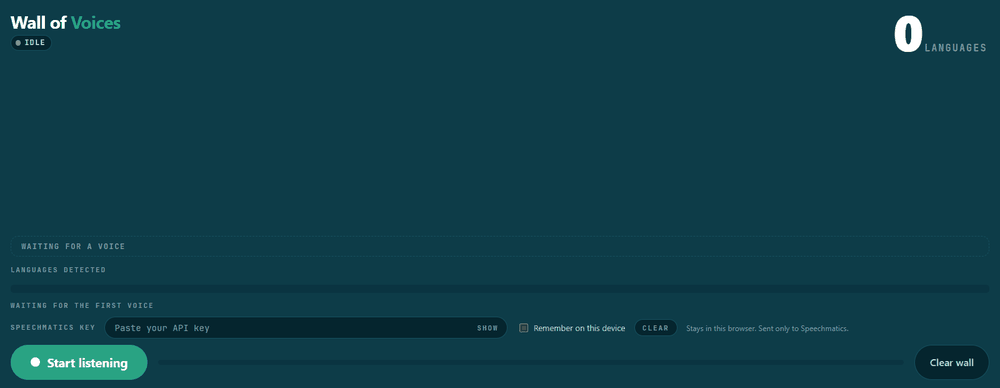
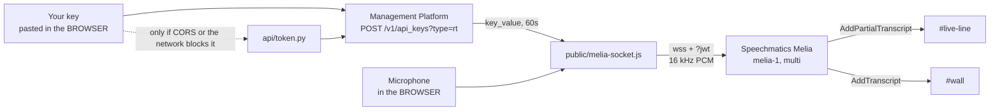

# Wall of Voices

**A stage demo for a room full of languages. One microphone goes around the audience, each person speaks a sentence in their own language, and their words land on a shared screen: coloured, labelled and correctly oriented by the language Melia detected, word by word.**

Melia (`model: "melia-1"`, `language: "multi"`) tags every word with its own ISO code, on partials as well as finals. Everything on this screen is a direct rendering of `alternatives[0].language`: colour, label, text direction. Nobody configures anything, and nothing is told which languages to expect.



The moment worth rehearsing is the code-switch. Open in English, drop one clause into another language mid-sentence, come back out, and the colour on the wall flips at the exact word the language did.

## What You'll Learn

- **`enable_partials` is required, and the Melia quickstart omits it.** Without it the endpoint sends finals only, and it fails silently.
- **Per-word language routing.** Colour, label and writing direction all come from one field, with no classifier and no post-processing.
- **Bring-your-own-key in a browser app.** The visitor pastes a key, the browser exchanges it for a short-lived one, and no long-lived credential is stored anywhere but their own browser.
- **Where the audio path belongs.** The microphone is in the browser, so the browser opens the Melia socket. Python only exchanges keys.
- **Right-to-left as a data-driven property.** Arabic, Hebrew, Persian, Urdu and Uyghur render RTL because the per-word code says so, not because anyone picked a locale.

## Prerequisites

- **Python 3.12.** `dev_server.py` and `api/token.py` import the standard library only.
- **Speechmatics API Key.** Sign up at [portal.speechmatics.com](https://portal.speechmatics.com/) and create a key under **API Keys**. It needs access to the Melia preview. You paste it into the page; see [Bring your own key](#bring-your-own-key).
- **A browser with microphone access**, Chrome or Edge. There is no build step and no `npm`: the page loads ES modules directly.
- **One microphone**, wired if you can, plus a projector or large display. Bluetooth microphones force the operating system into a mono narrowband profile the instant capture opens, costing you audio quality precisely when the audio is the demo. A wireless handheld with its own receiver is fine; it is the profile switch that hurts, not wirelessness.
- *Optional:* **PyAudio**, only for [`cli.py`](#clipy-the-same-tags-without-a-browser). Wheels ship for Windows. macOS and Linux build from source and need the PortAudio headers first (`brew install portaudio`, or `sudo apt install portaudio19-dev`).

## Quick Start

### Python

**Step 1: Create and activate a virtual environment**

**On Windows:**
```bash
python -m venv .venv
.venv\Scripts\activate
```

**On Mac/Linux:**
```bash
python3 -m venv .venv
source .venv/bin/activate
```

**Step 2: Install dependencies**

```bash
pip install -r requirements.txt
```

> [!NOTE]
> The wall itself installs nothing. Everything in `requirements.txt` belongs to [`cli.py`](#clipy-the-same-tags-without-a-browser), so skip to Step 3 if you only want the wall.

**Step 3: Run it**

```bash
python dev_server.py     # serves public/ and answers POST /api/token, in one process
```

**Step 4: Open the wall**

Open [http://localhost:3100](http://localhost:3100), paste your Speechmatics key into the key field, click **Start listening**, allow microphone access, and start talking.

**Step 5 (optional): stop pasting while you develop**

Run `cp .env.example .env` and add your key as `SPEECHMATICS_API_KEY`. `dev_server.py` then mints against it whenever the browser sends no key. That fallback is local only: `api/token.py` never reads the environment.

## How It Works



1. The page exchanges the pasted key for a 60-second realtime key, directly against the Management Platform, falling back to `POST /api/token`.
2. The browser opens a WebSocket to Melia with that temporary key in the query string and streams 16 kHz mono PCM from `getUserMedia`.
3. Partials paint into `#live-line` and finals commit as tiles on `#wall`, both carrying a per-word language code. The counter, legend and ribbon are recomputed once per animation frame from the committed tiles.

**The browser holds the microphone, so the browser holds the socket.** The token endpoint exists only to exchange a long-lived key for a short-lived one, and it never sits in the audio path. Streaming audio through Python instead is a real architecture, and the right one when you need server-side recording or redaction, but it needs a host that can keep a socket open and it adds a hop to a model that is already seconds behind. This demo gains nothing from it, so `speechmatics.rt` appears only in `cli.py`.

### File layout

`SPEECHMATICS_API_KEY` is read by `dev_server.py` and `cli.py` only. The one long-lived credential in the system arrives from the visitor's own keyboard.

```
10-wall-of-voices/
├── api/token.py          POST { apiKey } -> { jwt, ttl }. The only backend route.
├── public/               served statically, and holding no secret
│   ├── main.js           the key and its exchange, socket, repaint, counter, legend
│   ├── melia-socket.js   StartRecognition config and frame decode
│   ├── audio.js          getUserMedia to 16 kHz PCM
│   ├── wall.js           #live-line and #wall
│   ├── palette.js        language code to colour slot
│   ├── ribbon.js         the 100% stacked language mix
│   ├── languages.js      MELIA_LANGUAGES: code, name, native name, direction
│   ├── styles.css        the only file here that knows a colour value
│   └── index.html
├── cli.py                speechmatics.rt over a SERVER-side microphone
├── dev_server.py         serves public/ and /api/token. Stdlib only.
├── requirements.txt      the SDK, PyAudio and dotenv, all of it for cli.py
└── .env.example
```

### The config

```js
// public/melia-socket.js
socket.send(JSON.stringify({
  message: 'StartRecognition',
  audio_format: { type: 'raw', encoding: 'pcm_s16le', sample_rate: MELIA_SAMPLE_RATE },
  transcription_config: {
    language: 'multi',
    model: 'melia-1',
    enable_partials: true,
  },
}));
```

> [!IMPORTANT]
> **`enable_partials` is required and the quickstart omits it.** Against the live preview endpoint, `{ language: 'multi', model: 'melia-1' }` returns zero `AddPartialTranscript` messages. The failure is silent: finals still arrive, the wall still paints, and the demo just runs seconds behind the speaker.

`cli.py` sends the same three keys through the SDK, spelled `enable_partials=True`. Keys you may be tempted to add and must not: `max_delay`, `conversation_config`, `translation_config`, `diarization`, `enable_entities`. Melia rejects all of them and the connection fails at `StartRecognition`. It is ASR only, and there is no knob that makes its finals arrive sooner, which is why the demo is designed not to need one.

### The per-word tag is the demo

`AddPartialTranscript` and `AddTranscript` carry the same result shape, so one mapper serves both (`normaliseResults` in `melia-socket.js`):

```js
// for each result, alt = result.alternatives[0]
words.push({
  text: alt.content ?? '',
  language: alt.language ?? null,   // <- everything on screen derives from this
  startTime, endTime,               // Melia's own word clock
  isEos: result.is_eos === true,
  type,
});
```

From that one field the wall derives a **colour slot** (assigned when the language was first heard), a **label** from `public/languages.js`, and a **text direction** from the same table. No translation, no confidence threshold, no smoothing.

Direction is the clearest case. Melia detects five RTL languages (`ar` Arabic, `he` Hebrew, `fa` Persian, `ur` Urdu and `ug` Uyghur), every entry in `MELIA_LANGUAGES` carries a `dir` field, and a word tagged `ar` gets `dir="rtl"` and lays itself out right-to-left inside a wall that is otherwise left-to-right. Nobody picks a locale, and nothing in the UI has an RTL mode to switch into.

### What is on the screen

| Surface | Built by | What it holds |
| --- | --- | --- |
| **`#live-line`** | `wall.js`, `setLive()` | The in-flight partial, repainted several times a second. |
| **`#wall`** | `wall.js`, `commit()` | Finalised utterances, one tile each, oldest first. |
| **`#counter`** | `main.js`, `syncCounter()` | Distinct languages on the wall. The hero figure. |
| **`#legend`** | `main.js`, `syncLegend()` | One chip per language: swatch, name, native name, word count. |
| **`#ribbon`** | `ribbon.js`, `update()` | The language mix as a 100% stacked bar, plus a screen-reader table. |
| **`#reset-btn`** | `main.js`, `resetAll()` | **Clear wall**, which empties wall, counter, legend and ribbon together. |

**`#live-line` is a sibling of `#wall`, never a child.** The mid-sentence colour flip happens on partials, so it happens here, and inside the wall an accumulating stack of tiles would scroll it off the top of the screen. **The wall itself is a vertical-scroll grid, not a column.** `.wall` in `public/styles.css` is `display: grid` with `grid-template-columns: repeat(auto-fill, minmax(min(100%, 17rem), 1fr))`, `overflow-y: auto` and `overflow-x: hidden`, so tiles fill across, then down. `wall.js` follows the newest tile with `scrollTop = scrollHeight`, which does nothing while the content still fits. A wrapping flex column would spill tiles sideways, `overflow-x` would clip them, the vertical overflow would never happen, and the follow would become a silent no-op.

**Tiles shrink as they recede.** `wall.js#retier` assigns `.utterance--tier-0` through `--tier-3` after each commit, scaling type, padding and the slot-coloured rail together. Tiers go by **row, not by index**, because the column count changes with viewport width: tiles sharing an `offsetTop` are one row, and the tier counts rows up from the bottom. Old tiles are made smaller and quieter, never faded out, because a mis-detected language on an old tile is a talking point rather than something to hide.

**The counter counts committed tiles, not palette slots.** A palette slot means "this needs a colour", which includes the live line, and the live line is a hypothesis that can be revised away. So `syncCounter()` and `syncLegend()` both read `wall.stats()`, which reports only languages with words on a committed tile. The number under **LANGUAGES** is exactly what a person in the room can count on the screen.

### One sentence, one tile

Melia finalises when it is confident, not when the speaker finishes a sentence, so one spoken sentence often arrives as two finals. A tile per final would split that sentence in half under two identical language labels. So `VoiceWall.commit()` keeps a tile **open** and absorbs later finals until the sentence ends. Two signals close it, because neither is reliable alone: `is_eos` on the last result, and terminal punctuation (`.` `!` `?` `…` `。` `！` `？` `؟` `۔` `।` and the Greek question mark `U+037E`, which is not an ASCII semicolon even though it renders identically).

> [!IMPORTANT]
> A language change does **not** close a tile. "So the point is, това е важното, right?" is one sentence and belongs in one tile with the colour flipping inside it. Splitting on language would destroy the moment the whole demo exists for.

A speaker who trails off without punctuation would otherwise absorb whoever gets the microphone next, so `main.js` closes the open tile after a 1.5 second gap measured on Melia's word clock rather than the wall clock, and a 60-word cap backstops the case where punctuation never arrives at all. A wrong split costs one extra tile nobody notices; a wrong merge puts two people's sentences under one label in front of a room. Melia's finals run roughly three to six seconds behind the speaker, and partials arrive about two seconds ahead of their own finals. **This demo does not care, by design.** One person speaks at a time and the microphone is physically handed to the next, so the previous utterance settles on the wall inside the dead time a passed microphone creates for free.

### Bring your own key

The key belongs to whoever is at the keyboard. Paste it into the key bar above the controls: a `type="password"` input with a **Show**/**Hide** toggle and a **Clear** button, with no `name` attribute and `autocomplete` off, so no password manager mistakes it for a login field.

- **By default the key lives in `sessionStorage`**, meaning this tab until you close it. It is saved on every keystroke, so a reload mid-paste does not lose it.
- **Tick "Remember on this device" to promote it to `localStorage`** and it survives a browser restart. Ticking *moves* the key rather than copying it: one name, `wall-of-voices.api-key`, only ever one store holding it, and on reload the store it is found in is the remembered flag.
- **Clearing the field removes it from both stores**, as does **Clear**. Storage is best-effort, since private mode, a blocked-cookie policy and a full quota all throw, and every one of those is caught.
- **On a non-local host, Start stays disabled until a key exists.** The failure that gate prevents is discovering at the podium that `sessionStorage` cleared overnight, so if the button is greyed out, paste a key and it enables itself.

The browser exchanges that key for a temporary realtime key by calling the Management Platform **directly**, as `POST https://mp.speechmatics.com/v1/api_keys?type=rt` with an `Authorization: Bearer` header and `{ "ttl": 60 }`. If that call fails on CORS or the network, it retries through `POST /api/token` with `{ apiKey }`, which does the identical exchange from Python. Both halves live in `fetchTempKey()` in `public/main.js`. A 401 or 403 is not retried through the proxy: a rejected key is the visitor's to fix, so the session stops with one sentence on screen and the field keeps its value, making a typo an edit rather than a re-paste.

> [!IMPORTANT]
> **The temporary key, never the long-lived one, is what reaches the WebSocket.** It rides in the URL as `?jwt=`, because a browser's `WebSocket` constructor cannot set an `Authorization` header, and query strings end up in proxy logs and browser history. Sixty seconds is the API's floor and the whole containment strategy: a fresh key is minted per connection attempt, so the one that authorised a lost socket is already dead.

The key is never logged, never put in a URL, never echoed back, and never sent anywhere but `mp.speechmatics.com` or this app's own `/api/token`. `api/token.py` silences its own request logging, returns an upstream status and never an upstream body, and answers everything `Cache-Control: no-store`.

### cli.py: the same tags without a browser

`python cli.py` opens the **server-side** microphone, meaning the machine running Python is the machine being listened to, which is exactly why it can use the SDK directly. It is also the one part of this example that wants a key in `.env`. It lists the input devices, lets you pick one, starts a session with the same three-key `transcription_config`, and prints every word with the language Melia tagged it with, ending in a per-language tally:

```
[final]   so[en] the[en] point[en] is[en] това[bg] е[bg] важното[bg], right[en]?
languages:  2 -- en (5 words), bg (3 words)
```

It is the fastest way to check a key, a microphone, or whether partials are arriving, without a projector. Nothing in `api/` or `public/` imports it.

## Expected Output

A presenter opening in English, code-switching into Bulgarian, then the microphone going into the audience, with a fourth speaker mid-sentence in the live line:

```
#wall - finalised tiles, oldest first, filling across then down
  | ENGLISH  + Bulgarian
    so the point is това е важното right?   <- the Bulgarian words are bold,
                                              underlined and in their own colour
  | MANDARIN  普通话
    我们在上海有一个团队
  | ARABIC  العربية
    نحن نستخدم هذا كل يوم                    <- the whole tile is dir="rtl"

#live-line - the in-flight partial, a sibling of the wall
  o HINDI  हिन्दी
    मैं हर दिन इसका इस्तेमाल...

#counter - top right, and the closing slide:  3 LANGUAGES
```

Each tile carries a slot-coloured rail down its start edge, and the live line adds a pulsing dot that a committed tile does not have. The counter reads 3, not 4: Hindi is still in the live line, and only committed tiles count.

**The label is a name, not a code.** `wall.js#buildMeta` writes `meta?.name ?? dominant ?? 'Unrecognised'`, so a tile reads `ARABIC`, not `ar`, with the native name beside it in its own script. A bare ISO code means Melia sent a code that is not among the 55 entries in `public/languages.js`. It is shown rather than hidden, because "the model said `bxr`" is a discussable result in front of an audience. `+ Bulgarian` is `.utterance__also`, listing every language in the tile other than the dominant one, most words first, up to three before the remainder collapses to `+N`.

## Key Features Demonstrated

- **Zero-configuration multilingual ASR:** one model, one config, no language list, no per-speaker setup.
- **Per-word language identification on partials:** the tag arrives while the sentence is still being spoken, which is what makes the mid-sentence colour flip possible at all.
- **Mid-utterance code-switch detection:** the boundary is drawn at the word, not at the utterance, and RTL scripts render correctly from the same tag.
- **No credential in the app:** browser-supplied keys, exchanged for 60-second temporary ones.

## Configuration Options

- **Colour slots.** Eight CVD-validated values, `--series-1` through `--series-8` in `public/styles.css`, in a dark set and a light set. That stylesheet is the single source of truth for colour: `palette.js` hands out a slot *number*, renderers write `data-series="1"` to `"8"`, and `[data-series="N"] { --slot: var(--series-N) }` is where a number becomes a colour. Assignment is first-heard-first-served and cycles past eight, which is safe only because every surface names its language in text, so a repeated hue costs a grouping cue rather than a meaning. The ribbon, being a chart, refuses to reuse a hue and folds its tail into one achromatic **Other** segment instead.
- **Realtime host.** `wss://preview.rt.speechmatics.com/v2`, exported as `DEFAULT_MELIA_URL` from `public/melia-socket.js` and overridable via the constructor. It is not an environment variable, because this is browser code with no build step.
- **Temporary key TTL.** `SM_TOKEN_TTL`, in whole seconds, read by `api/token.py`. The default is 60, the API's floor, and that is the setting you want. Values outside 60 to 86400 are clamped, and an unparseable value falls back to the default rather than failing the request. The dev server's port is `PORT`, defaulting to 3100.
- **Language table.** `public/languages.js` holds 55 entries: code, English name, native name, direction. Add a row to teach the wall a language Melia tags that it cannot yet label.

## Running It On Stage

- **Check the key before the room fills.** Tick **Remember on this device** so a browser restart does not leave you pasting a key on stage.
- **Rehearse the code-switch line until it is boring.** Conversational speed, no pause at the language boundary, no announcing the switch beforehand. The whole effect is that the wall notices something you did not flag.
- **Get the mic close, and ask for full sentences.** Almost every mis-detection on stage is really a distance or length problem. "Hello" is a hard language-identification problem; a sentence about someone's morning is an easy one.
- **A mis-detection is a talking point, not a failure.** Say what happened, say why short utterances are hard, and move on. Nothing is hidden or dropped from the wall for looking wrong.
- **Use Clear wall between the rehearsal run and the live one.** It empties wall, counter, legend and ribbon in one press and leaves the session running, with no reload, no permission prompt and no re-paste. If the network drops mid-session the socket reopens with a freshly minted key and painting resumes, with placed words staying put. Practise both once.
- **Canvass the room first, and close on the counter.** Five to fifteen speakers is the sweet spot. Stop taking the microphone back, let the number sit on screen, and say it out loud.

## Next Steps

- **[Melia Multilingual Transcription](../../basics/12-melia-multilingual/)**: the same model over the Batch API in about twenty lines. Start here if per-word language tags are new to you.
- **[Voice API Explorer](../../basics/11-voice-api-explorer/)**: the realtime WebSocket surface in depth.

## Troubleshooting

**"Words appear, but only seconds after they are spoken"**
- `enable_partials` is missing from `transcription_config`. Check this first, always, because nothing errors. Log the `message` field of every frame the socket receives; if `AddPartialTranscript` never appears, that is the cause.

**"The socket closes immediately after StartRecognition"**
- A schema validation error, almost always from adding `max_delay` or `conversation_config`. Melia rejects both, so send only `language`, `model` and `enable_partials`. Otherwise the temporary key expired: it lives 60 seconds, so a page paused at a permission prompt can miss the window. Press Start again.

**"Speechmatics rejected that API key"**
- A 401 or 403, from the direct call or from `/api/token` as `invalid_api_key`. The key is wrong, has a stray space, or lacks Melia preview access. The field keeps its value so you can edit rather than re-paste, and the same key will fail in `python cli.py`, which is the quickest way to tell a bad key from a bad page.

**"Could not mint a realtime key"**
- `400 missing_api_key` means no `apiKey` in the request and no server key to fall back to, so paste a key in the browser or add one to `.env` and restart. `502 token_mint_failed` means the Management Platform timed out, refused for another reason, or returned no `key_value`. Only the upstream status comes back, never its body, because an error body can carry credential material.

**"The page loads but nothing renders"**
- An ES module served as `text/plain` will not execute, and Windows resolves `.js` from a registry key that is commonly exactly that, which is why `dev_server.py` pins the type itself rather than trusting `mimetypes`. Check the `Content-Type` on `main.js` in the network panel. Otherwise it is a cached module: static responses are `no-store` for this reason, since a stale `main.js` after an edit is indistinguishable from a bug. Hard-reload before you debug anything else.

**"Everything is being tagged as English"**
- Usually microphone distance or utterance length rather than the model. Get the capsule close and ask for a full sentence, and check that the mic feeding the browser is the one people are speaking into. A laptop's built-in array picking up the room while a handheld sits unselected produces exactly this symptom.

**"Arabic or Hebrew is rendering left-to-right"**
- The language code is not resolving against `MELIA_LANGUAGES`, so the `dir` lookup fell through to the default. Log the raw `alternatives[0].language` value and confirm it matches a `code` in `public/languages.js`.

**"`cli.py` says PyAudio is not installed, or finds no microphone"**
- Run `pip install -r requirements.txt` in the activated venv. PyAudio has no Linux or macOS wheel, so install the PortAudio headers first (`brew install portaudio`, or `sudo apt install portaudio19-dev`). On a headless box there is no microphone to find, since `cli.py` listens to the server-side one.

## Resources

- [Speechmatics documentation](https://docs.speechmatics.com/)
- [Speechmatics authentication and temporary keys](https://docs.speechmatics.com/get-started/authentication)
- [Speechmatics realtime API reference](https://docs.speechmatics.com/rt-api-ref)
- [Supported languages](https://docs.speechmatics.com/introduction/supported-languages)
- [Speechmatics Python SDK](https://github.com/speechmatics/speechmatics-python-sdk), the `speechmatics.rt` package `cli.py` uses

---

## Feedback

Help us improve this guide:
- Found an issue? [Report it](https://github.com/speechmatics/speechmatics-academy/issues)
- Have suggestions? [Open a discussion](https://github.com/orgs/speechmatics/discussions/categories/academy)

---

**Time to Complete**: 15 minutes
**Difficulty**: Intermediate
**API Mode**: Real-time
**Languages**: Python, JavaScript

[Back to Use Cases](../) | [Back to Academy](../../README.md)
